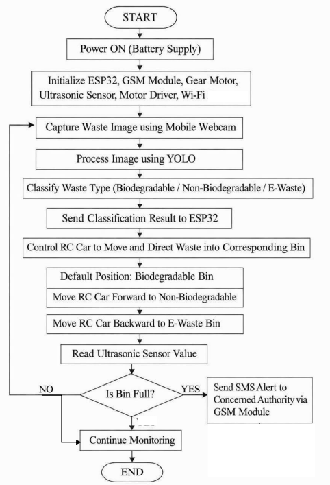

# Smart-Waste-Segregation-and-Monitoring-System-for-Sustainable-Cities
# 📌 Table of Contents

Project Description

Components Used

System Working

System Flowchart

Hardware Setup

Output

Applications

Future Scope

Conclusion

# 🌍 Project Description

The Smart Waste Segregation and Monitoring System is an AI and IoT-based project designed to automate waste management and improve efficiency in smart cities and public environments.

The system uses a mobile webcam to capture waste images, which are processed using a YOLOv8 deep learning model to classify waste into biodegradable, non-biodegradable, and e-waste categories.

Based on the classification result, an ESP32 microcontroller controls an RC car equipped with a gear motor to move and direct the waste into the correct bin automatically.

Another ESP32 continuously monitors the bin level using an ultrasonic sensor. When the bin reaches a predefined threshold, a Telegram bot automatically sends an alert notification to the concerned authority for timely waste collection.

This system reduces manual labour, improves waste segregation accuracy, and enables real-time monitoring for sustainable waste management.

# 🔧 Components Used

# Hardware Components

ESP32 Microcontroller (×2)

Mobile Webcam

HC-SR04 Ultrasonic Sensor

L298N Motor Driver

Gear Motor

RC Car Chassis

# Software & Tools

Python

YOLOv8

OpenCV

Arduino IDE

Telegram Bot API

# ⚙️ System Working

Step 1 — Waste Image Capture

A mobile webcam continuously captures images of the waste item placed in front of the webcam.

Step 2 — AI-Based Waste Classification

The captured image is processed using the YOLOv8 deep learning model. The waste is classified into:

🟢 Biodegradable Waste
🔵 Non-Biodegradable Waste
🔴 E-Waste

Step 3 — Sending Classification Result to ESP32

After classification, the result is transmitted to ESP32 #1 via WiFi for controlling the RC car movement.

Step 4 — RC Car Movement and Waste Segregation

Based on the detected waste category, the RC car moves automatically toward the corresponding bin:

🟢 Biodegradable Waste → RC car remains in the centre/default position
🔵 Non-Biodegradable Waste → RC car moves backward
🔴 E-Waste → RC car moves forward

The servo mechanism then directs the waste into the appropriate waste bin automatically.

Step 5 — Bin Level Monitoring

ESP32 #2 continuously monitors the waste level inside the bin using the HC-SR04 ultrasonic sensor.

Step 6 — Telegram Alert Notification

When the waste level exceeds the predefined threshold, the Telegram bot automatically sends an alert notification to the concerned authority for timely waste collection.

# 🔄 System Flowchart

# 📸 Hardware Setup

# 🖥️ Output

The following outputs demonstrate real-time waste classification using the YOLOv8 model and Telegram alert notifications generated when the waste bin reaches the threshold level.

# 🏙️ Applications

Smart Cities

Shopping Malls

Railway Stations

Airports

Hospitals

# 🔮 Future Scope

☁️ Cloud-based waste monitoring dashboard

📱 Mobile application integration

☀️ Solar-powered smart bin system

🗺️ GPS tracking for waste collection vehicles

📊 Waste analytics and reporting system

# 🏁 Conclusion

The Smart Waste Segregation and Monitoring System combines Artificial Intelligence, IoT, and automation technologies to improve waste management efficiency. By integrating YOLOv8-based waste classification, ESP32-controlled RC car movement, ultrasonic monitoring, and Telegram alert notifications, the system provides an intelligent, scalable, and low-cost solution for sustainable waste management in smart cities and public environments.
